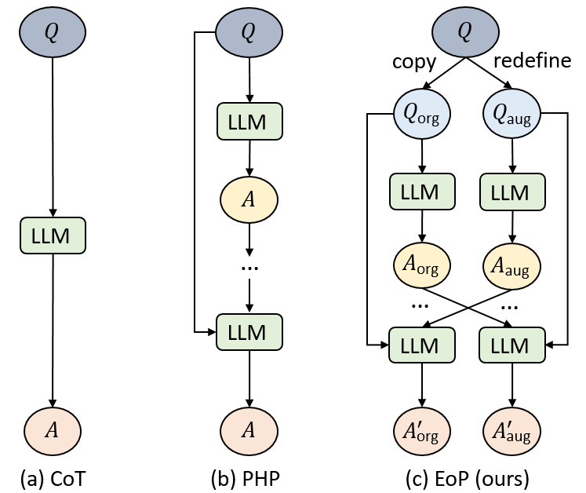

# Official Repo of Exchange of Perspective (EoP)

<p>
    <a href="https://copyright.princeton.edu/policy">
        
    </a>
</p>


Official implementation for paper `Exchange of Perspective Prompting Enhances Reasoning in Large Language Models` with code, prompts, model outputs.

## Installation
```sh
pip install jsonlines
pip install openai
pip install jinja2
```

## Usage
The code needs to be configured with your account' secret key. 
Set `api_key` and `azure_endpoint` to its value:

```python
api_key = "Put Your Key Here"
azure_endpoint ="Put Your azure_endpoint url"
```

## Run
We run the `main` with the following:
```sh
python main.py --prompt_dir [base prompt] --eng [openAI model] --seed [seed number] --hint [PHP prompt] --dataset [datasetname] --num_test -1 --q1 [ori: standard or CoT, complex: complex CoT] --q2 [ori: standard or CoT, complex: complex CoT] --sample [sample number] --temp [0.0 for greedy, 0.7 for sc]
```
Or, we can just use the file in bash directory:
```sh
bash scripts/cot.sh
```
